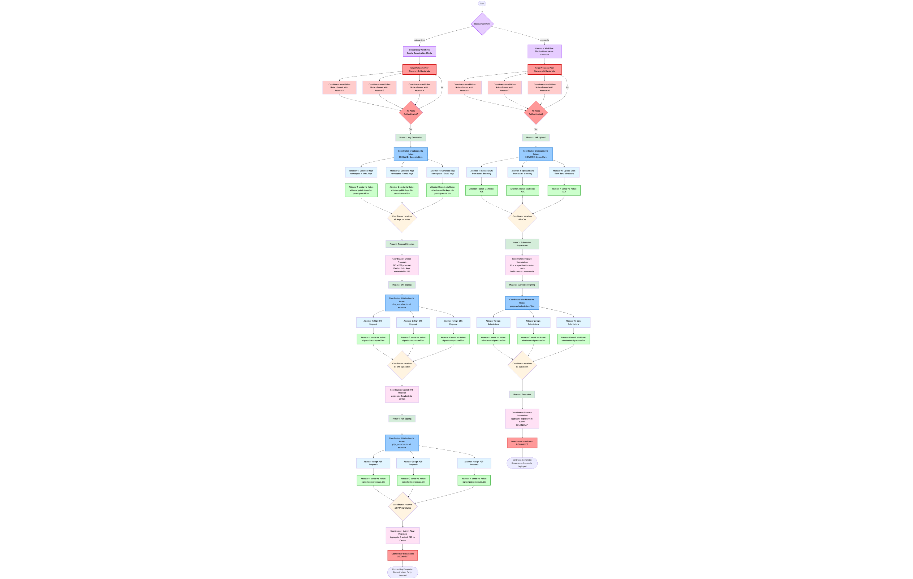

# Canton Decentralized Party Onboarding Automatization

A Rust-based automation tool for multi-party decentralized namespace setup in Canton blockchain networks. This project streamlines the complex process of onboarding multiple parties to a Canton-based Bitcoin (CBTC) governance system by automating topology management, cryptographic key generation, and ledger operations.

## Key Features

- **Automated Multi-Party Onboarding**: Orchestrates the complete workflow for setting up decentralized party participation
- **Secure Communication**: Noise Protocol Framework for encrypted, authenticated peer-to-peer communication
- **gRPC Integration**: Native Canton Admin and Ledger API integration using Protocol Buffers
- **Cryptographic Key Management**: Automated generation and management of cryptographic keys for secure party identification
- **Topology Management**: Handles DNS and P2P proposal creation, signing, and submission (Canton 3.4+: signing keys embedded in P2P)
- **Ledger Operations**: Manages preparation, signing, and execution of ledger submissions
- **Distributed Architecture**: Coordinator-attestor model with no single point of trust
- **Configuration-Driven**: Flexible TOML-based configuration for different Canton environments
- **Production Ready**: Includes comprehensive error handling, logging, and code quality tooling

## Architecture

This tool implements a port of Canton Scala scripts to Rust, providing a more performant and memory-safe alternative for automated party onboarding. It follows a step-based workflow that ensures proper ordering of operations and handles the complex interdependencies between topology changes and ledger state modifications.

### Communication Model

All coordination between participants uses the **Noise Protocol Framework** for secure, encrypted communication:
- **Coordinator** acts as server, orchestrating the workflow (is also an attestor)
- **Attestors** connect as clients, executing commands and returning results
- **Mutual Authentication** via static keypairs (secp256k1)
- **Encrypted Channels** using ChaChaPoly-1305 AEAD cipher

See the [Noise Protocol Communication Architecture](docs/NOISE_PROTOCOL_COMMUNICATION.md) for detailed information.

### Visual Workflow



The complete workflow diagram showing all phases, Noise protocol communications, and data flows between coordinator and attestors.

## Table of Contents

- [Project Overview](#project-overview)
- [Documentation](#documentation)
- [Setup](#setup)
  - [Configuration](#configuration)
- [Usage](#usage)
  - [Run All Steps in Sequence](#run-all-steps-in-sequence)
  - [Run Individual Steps](#run-individual-steps)
  - [Generate Noise Protocol Keys](#generate-noise-protocol-keys)
  - [Get Help](#get-help)
- [Development](#development)
  - [Run Tests](#run-tests)
  - [Run Tests with Output](#run-tests-with-output)
  - [Run Specific Test](#run-specific-test)
- [Code Quality](#code-quality)
  - [Coding Standards](#coding-standards)
  - [Run Clippy (Strict Mode)](#run-clippy-strict-mode)
  - [Auto-fix Clippy Issues](#auto-fix-clippy-issues)
  - [Format Code](#format-code)
  - [Check Formatting Without Modifying Files](#check-formatting-without-modifying-files)

## Project Overview

This project ports Canton Scala scripts to Rust, implementing a multi-party decentralized namespace setup for CBTC (Canton-based Bitcoin) governance. The workflow includes:

1. **Step 1**: Upload DARs and generate cryptographic keys
   - Automatically uploads all `.dar` files from the `dars/` directory
2. **Step 1a**: Create topology proposals (DNS, P2P with embedded keys - Canton 3.4+)
3. **Steps 2-3a**: Multi-party signing and submission of topology proposals
4. **Steps 3b-5**: Prepare, sign, and execute ledger submissions

**Canton 3.4 Change**: The separate `PartyToKeyMapping` transaction has been deprecated. Signing keys are now embedded directly in the `PartyToParticipant` (P2P) mapping.

**Status**: All implementation phases complete. For detailed documentation, see [docs/TODO.md](./docs/TODO.md).

## Documentation

- **[docs/NOISE_PROTOCOL_COMMUNICATION.md](./docs/NOISE_PROTOCOL_COMMUNICATION.md)** - Comprehensive guide to secure peer-to-peer communication architecture
- **[docs/TODO.md](./docs/TODO.md)** - Detailed implementation plan, API mappings, and step-by-step breakdown
- **[docs/CODING-STANDARDS.md](./docs/CODING-STANDARDS.md)** - Project coding standards and style guide
- **[network.example.toml](./network.example.toml)** - Example network topology configuration
- **[node.example.toml](./node.example.toml)** - Example node configuration
- **[test-configs/](./test-configs/)** - Pre-configured test setup for 3 participants

## Setup

## Configuration

This project uses a distributed configuration system for multi-party setups:

- **Network Configuration** (`network.toml`): Shared topology with all participants and Noise protocol keys
- **Node Configuration** (`node-X.toml`): Individual node settings with Canton connection details

### Using Test Configurations

Pre-configured test setups are available in `test-configs/`:

```sh
# Run commands for different participants
cargo run -- -c test-configs/node-1.toml <command>  # Coordinator
cargo run -- -c test-configs/node-2.toml <command>  # Attestor 2
cargo run -- -c test-configs/node-3.toml <command>  # Attestor 3
```

### Creating Custom Configuration

1. **Generate Noise keypairs** for secure communication:
```sh
cargo run -- keygen -o keys/participant-1.key
```

2. **Create network.toml** based on `network.example.toml`:
```toml
[network]
name = "my-network"
coordinator_strategy = "explicit"

[[participants]]
id = "participant-1"
role = "coordinator"
public_key = "<hex-encoded-public-key>"
# ... more participants
```

3. **Create node-X.toml** for each participant based on `node.example.toml`:
```toml
network_config = "network.toml"

[node]
participant_id = "participant-1"
static_key_file = "keys/participant-1.key"
listen_address = "0.0.0.0"

[canton]
admin_api_host = "localhost"
admin_api_port = 5012
ledger_api_host = "localhost"
ledger_api_port = 5011
synchronizer = "global"
# Optional: JWT token for Ledger API authentication
# ledger_api_token = "your-jwt-token-here"
```

See `test-configs/README.md` for detailed documentation.

## Run The App

### Run All Steps in Sequence

```sh
cargo run --release -- -c test-configs/node-1.toml all
```

### Run Individual Steps

```sh
# Step 1: Upload DARs (automatically uploads all .dar files from dars/ directory)
cargo run --release -- -c test-configs/node-1.toml upload-dars

# Step 1: Generate keys and export participant ID
cargo run --release -- -c test-configs/node-1.toml generate-keys

# Step 1a: Create topology proposals
cargo run --release -- -c test-configs/node-1.toml create-proposals

# Step 2: Sign DNS proposals
cargo run --release -- -c test-configs/node-1.toml sign-dns-proposals

# Step 2a: Submit DNS proposals
cargo run --release -- -c test-configs/node-1.toml submit-dns-proposals

# Step 3: Sign P2P proposals (Canton 3.4+: signing keys embedded in P2P)
cargo run --release -- -c test-configs/node-1.toml sign-p2p-proposals

# Step 3a: Submit final proposals
cargo run --release -- -c test-configs/node-1.toml submit-final-proposals

# Step 3b: Prepare ledger submissions
cargo run --release -- -c test-configs/node-1.toml prepare-submissions

# Step 4: Sign ledger submissions
cargo run --release -- -c test-configs/node-1.toml sign-submissions

# Step 5: Execute ledger submissions
cargo run --release -- -c test-configs/node-1.toml execute-submissions
```

### Generate Noise Protocol Keys

```sh
# Generate a keypair for secure node-to-node communication
cargo run -- keygen -o keys/my-node.key
```

The public key will be displayed and should be added to `network.toml`.

### Get Help

```sh
cargo run -- --help
```

## Development

### Run Tests

```sh
cargo test
```

### Run Tests with Output

```sh
cargo test -- --nocapture
```

### Run Specific Test

```sh
cargo test test_name
```

## Code Quality

### Run Clippy (Strict Mode)

This project uses strict clippy settings. Run clippy to check for warnings:

```sh
cargo clippy --all-targets --all-features -- -D warnings
```

### Auto-fix Clippy Issues

```sh
cargo clippy --fix --all-targets --all-features -- -D warnings
```

### Format Code

```sh
cargo fmt
```

### Check Formatting Without Modifying Files

```sh
cargo fmt -- --check
```
